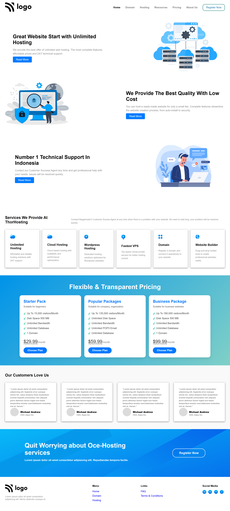

# HTML-CSS-PROJECT-11

Project: Responsive Website with CSS Grid

In this project, we uses CSS Grid and media queries to create a responsive website that adapts to different screen sizes and devices.

# Description

This project involves creating a responsive website using CSS Grid and media queries. The website is designed to adapt to different screen sizes and devices, providing an optimal user experience.

# Key Features:

CSS Grid layout for responsive design
Media queries for different screen sizes (tablet, desktop, mobile)
Adaptive layout for optimal user experience

Time Taken: 3 days

# Main Points:

CSS Grid: used to create a responsive layout with a maximum width of 1200px and padding of 20px
Media Queries: used to apply different styles based on screen size (tablet, desktop, mobile)
Responsive design: adapts to different screen sizes and devices for optimal user experience

# Screenshot

